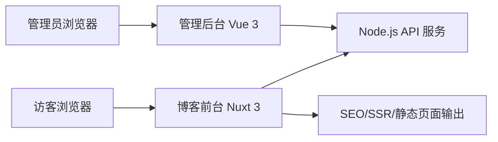

# 个人博客前端技术文档

## 1. 文档信息

| 项目 | 内容 |
| --- | --- |
| 文档名称 | 个人博客前端技术文档 |
| 适用范围 | 博客前台站点、管理后台前端 |
| 技术栈 | Vue 3 |
| 文档版本 | V1.0 |
| 编写日期 | 2026-03-16 |

## 2. 建设目标

前端系统需要同时满足以下目标：

- 面向访客提供高性能、强 SEO、适配移动端的博客阅读体验；
- 面向博主提供易用的内容管理后台；
- 支持文章、分类、标签、归档、搜索、项目展示、关于页等核心功能；
- 保持展示站点与管理后台的职责清晰，便于后续扩展评论、订阅、统计等增强能力；
- 保证工程可维护性，支持主题升级、组件复用和持续迭代。

## 3. 总体技术方案

### 3.1 技术选型

前端采用双应用方案：

- 博客前台：`Nuxt 3`，底层为 `Vue 3`
- 管理后台：`Vue 3 + Vite`

配套技术建议如下：

| 层级 | 选型 |
| --- | --- |
| 前台框架 | Nuxt 3 |
| 后台框架 | Vue 3 + Vite |
| 语言 | TypeScript |
| 路由 | Nuxt File Router、Vue Router |
| 状态管理 | Pinia |
| UI 方案 | 前台自定义主题组件；后台使用 Element Plus |
| 网络请求 | ofetch / Axios |
| 表单校验 | Zod + vee-validate |
| Markdown 渲染 | markdown-it / @nuxt/content 风格方案 |
| 代码高亮 | Shiki / Prism.js |
| 样式方案 | SCSS + CSS Variables |
| 构建工具 | Vite |
| 测试 | Vitest、Vue Test Utils、Playwright |
| 代码规范 | ESLint、Prettier、Stylelint |

### 3.2 选型说明

选择该方案的原因如下：

- 博客对 SEO、首屏性能、文章详情收录较敏感，前台适合使用 SSR/SSG 方案；
- 管理后台以表单、列表、配置操作为主，使用 Vue 3 + Vite 可以提升开发效率；
- 双应用架构可以避免后台逻辑和前台展示强耦合，便于权限控制和部署隔离；
- 前台和后台保持统一语言、统一状态管理思想、统一组件规范，降低维护成本。

## 4. 前端架构设计

### 4.1 架构分层



### 4.2 应用拆分

建议拆分为两个前端应用：

- `apps/web`：博客前台，面向访客
- `apps/admin`：管理后台，面向博主

推荐仓库组织如下：

```text
frontend/
├─ apps/
│  ├─ web/                 # Nuxt 3 博客前台
│  └─ admin/               # Vue 3 管理后台
├─ packages/
│  ├─ shared-types/        # 前后端共享类型
│  ├─ shared-utils/        # 通用工具
│  └─ ui/                  # 可复用基础组件
└─ docs/
```

### 4.3 渲染策略

不同页面采用不同渲染模式：

| 页面 | 渲染方式 | 原因 |
| --- | --- | --- |
| 首页 | SSR + 缓存 | 兼顾首屏速度与 SEO |
| 文章详情页 | SSR 或 ISR | 内容收录重要，正文需要首屏可读 |
| 分类页/标签页 | SSR | 聚合页需要搜索引擎识别 |
| 归档页 | SSG 或 SSR | 更新频率较低，可静态化 |
| 关于页 | SSG | 内容变更少 |
| 项目页 | SSG + API 增量更新 | 稳定展示为主 |
| 搜索结果页 | CSR + API | 用户实时搜索交互为主 |
| 管理后台 | CSR | 无 SEO 要求，强调交互效率 |

## 5. 功能模块设计

### 5.1 博客前台模块

| 模块 | 主要职责 |
| --- | --- |
| 首页模块 | 展示博客定位、最新文章、精选内容、分类入口 |
| 文章模块 | 文章列表、详情、目录、上下篇、相关推荐 |
| 分类标签模块 | 分类聚合、标签聚合、筛选跳转 |
| 归档模块 | 按年月归档展示历史文章 |
| 搜索模块 | 搜索框、搜索结果页、空结果提示 |
| 关于模块 | 个人介绍、技能、经历、联系方式 |
| 项目模块 | 项目列表、项目详情、外链跳转 |
| SEO 模块 | Meta、Open Graph、结构化数据、Sitemap 支撑 |
| 通用布局模块 | 导航、页脚、主题样式、404 页面 |

### 5.2 管理后台模块

| 模块 | 主要职责 |
| --- | --- |
| 登录鉴权 | 管理员登录、Token 管理、路由守卫 |
| 概览 | 展示文章数、分类数、最近更新、访问趋势 |
| 文章管理 | 新建、编辑、发布、下线、预览、置顶 |
| 分类标签管理 | 分类和标签的增删改查 |
| 页面管理 | 关于页、首页推荐、页脚等配置 |
| 项目管理 | 项目内容维护 |
| 媒体管理 | 图片上传、素材复用 |
| 站点设置 | 站点名称、Logo、导航、SEO 默认配置 |
| 备份导出 | 文章导出、配置导出、操作记录 |

## 6. 页面设计与路由规划

### 6.1 博客前台路由

| 路由 | 页面说明 |
| --- | --- |
| `/` | 首页 |
| `/articles` | 文章列表页 |
| `/articles/:slug` | 文章详情页 |
| `/category/:slug` | 分类聚合页 |
| `/tag/:slug` | 标签聚合页 |
| `/archive` | 归档页 |
| `/search` | 搜索结果页 |
| `/projects` | 项目列表页 |
| `/projects/:slug` | 项目详情页 |
| `/about` | 关于我页面 |
| `/:pathMatch(.*)*` | 404 页面 |

### 6.2 管理后台路由

| 路由 | 页面说明 |
| --- | --- |
| `/login` | 登录页 |
| `/dashboard` | 后台首页 |
| `/posts` | 文章列表 |
| `/posts/create` | 新建文章 |
| `/posts/:id/edit` | 编辑文章 |
| `/categories` | 分类管理 |
| `/tags` | 标签管理 |
| `/pages` | 页面配置 |
| `/projects` | 项目管理 |
| `/media` | 媒体管理 |
| `/settings` | 站点设置 |
| `/backup` | 备份导出 |

## 7. 组件设计

### 7.1 前台核心组件

| 组件 | 说明 |
| --- | --- |
| `AppHeader` | 顶部导航与搜索入口 |
| `HeroBanner` | 首页品牌介绍区域 |
| `ArticleCard` | 文章卡片摘要组件 |
| `ArticleMeta` | 发布时间、更新时间、分类、标签 |
| `ArticleToc` | 文章目录组件 |
| `MarkdownRenderer` | Markdown 内容渲染组件 |
| `CodeBlock` | 代码块高亮与复制 |
| `CategoryNav` | 分类快捷导航 |
| `TagList` | 标签聚合显示 |
| `ProjectCard` | 项目展示卡片 |
| `EmptyState` | 空结果提示组件 |
| `PaginationBar` | 分页组件 |
| `SiteFooter` | 页脚组件 |

### 7.2 后台核心组件

| 组件 | 说明 |
| --- | --- |
| `AdminLayout` | 后台整体布局 |
| `SidebarMenu` | 后台菜单导航 |
| `PostEditor` | 文章编辑器容器 |
| `PostMetaForm` | 文章元信息编辑表单 |
| `MarkdownEditor` | Markdown 编辑器 |
| `UploadPanel` | 图片与文件上传组件 |
| `FilterToolbar` | 列表筛选组件 |
| `SeoConfigForm` | SEO 配置表单 |
| `SettingForm` | 站点设置组件 |
| `PreviewDrawer` | 预览抽屉 |

## 8. 状态管理设计

前端状态建议按业务域拆分为多个 Pinia Store：

| Store | 作用 |
| --- | --- |
| `useSiteStore` | 站点基础信息、导航、页脚、默认 SEO |
| `useArticleStore` | 文章列表、文章详情、分页信息 |
| `useSearchStore` | 搜索关键词、结果、搜索状态 |
| `useCategoryStore` | 分类、标签、归档聚合数据 |
| `useProjectStore` | 项目列表与详情 |
| `useAuthStore` | 后台登录态、Token、当前管理员信息 |
| `useDashboardStore` | 后台统计概览数据 |
| `useEditorStore` | 编辑器内容、草稿状态、预览状态 |

状态管理原则：

- 页面级异步数据优先使用服务端数据获取能力，避免冗余缓存；
- 仅将需要跨页面共享的数据放入 Store；
- 管理后台的表单编辑状态与保存状态单独维护；
- 对文章详情和站点配置引入缓存失效策略，减少重复请求。

## 9. 数据交互设计

### 9.1 API 调用原则

- 前后台统一使用 RESTful API；
- 统一封装请求拦截、错误处理、鉴权头注入与重试策略；
- 使用 TypeScript 类型约束请求与响应结构；
- 对分页、搜索、筛选条件采用统一 Query 参数格式；
- 前台优先读取后端返回的聚合数据，减少浏览器端二次拼装。

### 9.2 接口分类

| 接口分类 | 示例 |
| --- | --- |
| 公开接口 | 首页数据、文章列表、文章详情、分类标签、搜索 |
| 管理接口 | 登录、文章管理、分类标签管理、页面配置、项目管理 |
| 文件接口 | 图片上传、封面上传、附件管理 |
| 配置接口 | 站点设置、SEO 默认配置、导航配置 |
| 统计接口 | 概览趋势、热门文章、基础访问数据 |

## 10. 文章渲染与编辑设计

### 10.1 内容格式

文章正文统一采用 `Markdown` 存储，前端负责渲染展示，优点如下：

- 适合个人博客持续写作；
- 易导出、易迁移；
- 对版本管理友好；
- 可以较低成本支持代码块、引用、表格、图片等能力。

### 10.2 前台渲染能力

前台文章详情页需要具备以下渲染能力：

- 标题层级解析并生成目录；
- 代码块高亮；
- 图片懒加载和点击预览；
- 表格横向滚动；
- 引用块、任务列表、链接样式优化；
- 支持文章锚点跳转；
- 支持文章内链识别。

### 10.3 后台编辑能力

后台编辑器建议支持：

- Markdown 实时编辑；
- 元信息表单与正文分区；
- 封面图上传；
- 分类、标签选择；
- 草稿保存；
- 发布与下线操作；
- 前台预览；
- 自动保存提醒。

## 11. SEO 与性能方案

### 11.1 SEO 实现

前台需要覆盖以下 SEO 能力：

- 页面级 `title`、`meta description`、`keywords`；
- 文章详情页注入 Open Graph 和 Twitter Card 元信息；
- 生成 `sitemap.xml` 与 `robots.txt`；
- 文章、分类、标签页使用语义化 HTML 结构；
- 输出结构化数据，如 `BlogPosting`、`BreadcrumbList`；
- 保持 slug 稳定，避免频繁变更地址。

### 11.2 性能优化

建议从以下方面优化：

- 首页与文章页开启 SSR 缓存；
- 图片使用压缩、响应式尺寸和懒加载；
- 非首屏模块延迟加载；
- 长列表使用分页，避免一次加载过多文章；
- 管理后台路由按页面分包；
- 代码高亮和评论等增强能力按需加载；
- 使用 CDN 托管静态资源。

## 12. 响应式与体验设计

### 12.1 响应式策略

| 终端 | 设计重点 |
| --- | --- |
| 桌面端 | 阅读宽度、目录侧栏、推荐内容展示 |
| 平板端 | 栅格压缩、侧栏折叠 |
| 手机端 | 折叠菜单、目录抽屉、代码块横向滚动 |

### 12.2 可用性要求

- 正文宽度、字号、行高适配长文阅读；
- 搜索入口固定可触达；
- 文章目录在移动端支持抽屉式展开；
- 后台表单支持未保存提醒；
- 上传、保存、发布操作需要明确反馈；
- 404 页面提供返回首页和文章列表的快捷入口。

## 13. 安全设计

前端侧的安全措施包括：

- 管理后台登录态使用 HttpOnly Cookie 或短期 Token 机制；
- 路由守卫控制后台页面访问；
- 上传组件校验文件类型、大小和扩展名；
- 对富文本、Markdown 渲染结果进行 XSS 过滤；
- 关键操作如删除、下线、导出增加二次确认；
- 避免将敏感配置暴露在浏览器端环境变量中。

## 14. 工程规范

### 14.1 目录建议

博客前台建议目录：

```text
apps/web/
├─ app.vue
├─ pages/
├─ layouts/
├─ components/
├─ composables/
├─ stores/
├─ services/
├─ utils/
├─ styles/
└─ middleware/
```

管理后台建议目录：

```text
apps/admin/
├─ src/
│  ├─ views/
│  ├─ components/
│  ├─ router/
│  ├─ stores/
│  ├─ api/
│  ├─ hooks/
│  ├─ utils/
│  └─ styles/
```

### 14.2 编码规范

- 统一使用 TypeScript；
- 组件采用单文件组件 `SFC`；
- 业务组件与基础组件分层；
- API 类型与业务模型统一维护；
- 路由、Store、接口命名保持一致；
- 提交前执行 lint、test、build 检查。

## 15. 测试方案

### 15.1 测试分层

| 测试类型 | 范围 |
| --- | --- |
| 单元测试 | 组件逻辑、工具函数、Store |
| 组件测试 | 文章卡片、目录、分页、后台表单 |
| 集成测试 | 页面加载、API 交互、权限跳转 |
| E2E 测试 | 登录、发文、编辑、搜索、浏览文章 |

### 15.2 重点验证场景

- 首页可正常渲染最新文章和推荐内容；
- 文章详情页可正确生成目录并高亮代码；
- 分类、标签、归档聚合页可正常跳转；
- 搜索结果页可返回命中内容；
- 后台登录、创建文章、编辑文章、发布文章流程可用；
- 移动端文章页和代码块展示正常；
- SEO 相关元信息可正确输出。

## 16. 部署建议

前端部署建议如下：

- 博客前台部署到支持 Node SSR 的环境，如 Nginx + Node 运行容器；
- 管理后台构建为静态资源，由 Nginx 托管；
- 静态资源接入 CDN；
- 发布时区分 `web` 和 `admin` 两个流水线；
- 配置灰度发布与回滚机制；
- 站点地图在构建或发布阶段自动生成。

## 17. 版本实施建议

### 17.1 MVP 范围

- 前台：首页、文章列表、文章详情、分类、标签、搜索、关于页；
- 后台：登录、文章管理、分类标签管理、站点设置；
- SEO：页面元信息、站点地图、友好链接；
- 工程：基础测试、日志、错误页、响应式适配。

### 17.2 二期扩展

- 项目详情页增强；
- 阅读量和热门文章展示；
- 评论、点赞、订阅；
- 专题页、置顶推荐；
- 主题切换和更强个性化设计。

## 18. 结论

本前端方案以 `Vue 3` 生态为核心，采用“前台 Nuxt 3 + 后台 Vue 3”的组合方式，在保证 SEO、性能和阅读体验的同时，也兼顾了后台维护效率与后续扩展空间。该方案适合个人博客从 MVP 快速上线，再逐步演进为具备项目展示、互动和数据分析能力的长期内容平台。
