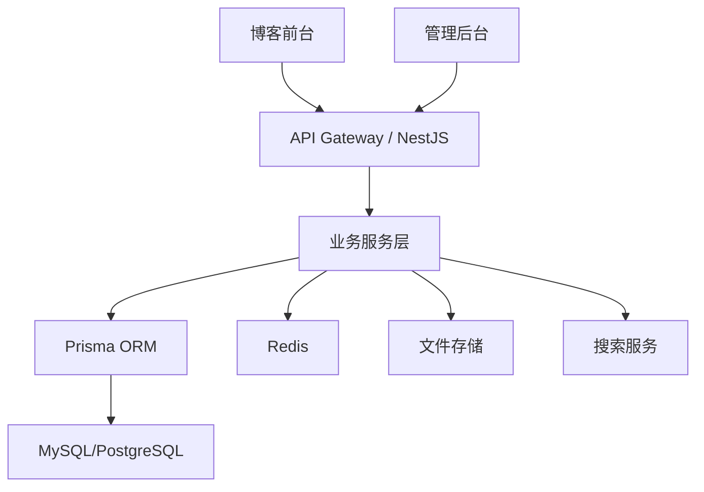

# 个人博客后端技术文档

## 1. 文档信息

| 项目 | 内容 |
| --- | --- |
| 文档名称 | 个人博客后端技术文档 |
| 适用范围 | 博客内容管理、公开接口、后台管理接口 |
| 技术栈 | Node.js |
| 文档版本 | V1.0 |
| 编写日期 | 2026-03-16 |

## 2. 建设目标

后端系统需要围绕个人博客的内容生产、内容分发和后台维护三个核心场景设计，目标如下：

- 为前台站点提供稳定、清晰、可缓存的内容接口；
- 为管理后台提供完整的内容管理、配置管理和权限控制能力；
- 支持文章、分类、标签、项目、页面配置、搜索、SEO、备份导出等功能；
- 保持数据结构可迁移、可扩展，降低后期更换主题或升级系统的成本；
- 兼顾单管理员博客场景下的简洁性和后续扩展能力。

## 3. 总体技术方案

### 3.1 技术选型

建议采用以下后端技术组合：

| 层级 | 选型 |
| --- | --- |
| 运行时 | Node.js 20+ |
| 服务框架 | NestJS |
| 语言 | TypeScript |
| ORM | Prisma |
| 数据库 | MySQL 8.0 或 PostgreSQL 15 |
| 缓存 | Redis |
| 搜索方案 | 数据库全文检索为 MVP，后续可扩展 Meilisearch |
| 鉴权 | JWT + Refresh Token / HttpOnly Cookie |
| 文件存储 | 本地存储或对象存储（MinIO、OSS、S3） |
| 参数校验 | class-validator / Zod |
| 日志 | Winston / Pino |
| 接口文档 | Swagger(OpenAPI) |
| 任务调度 | @nestjs/schedule |
| 测试 | Jest、Supertest |

### 3.2 选型说明

- `NestJS` 适合分层架构，模块边界清晰，便于维护和扩展；
- `Prisma` 对数据模型迁移、类型约束和开发效率都较友好；
- 博客属于中低并发内容型系统，数据库全文搜索可先满足 MVP；
- `Redis` 可用于热点缓存、会话控制、限流和搜索结果缓存；
- 文件存储采用抽象层设计，便于先本地、后云存储平滑切换。

## 4. 后端总体架构

### 4.1 架构图



### 4.2 分层设计

后端建议采用经典分层：

- `Controller`：负责路由接入、参数接收、响应输出；
- `Service`：负责业务编排；
- `Repository / Prisma`：负责数据库访问；
- `DTO / Schema`：负责输入输出校验；
- `Guard / Interceptor / Filter`：负责鉴权、日志、异常处理；
- `Task`：负责定时任务、数据同步、缓存刷新、备份导出。

## 5. 模块划分

建议按业务能力拆分 NestJS 模块：

| 模块 | 主要职责 |
| --- | --- |
| `AuthModule` | 登录、鉴权、Token 刷新、管理员信息 |
| `UserModule` | 管理员账号信息维护 |
| `PostModule` | 文章新增、编辑、发布、下线、查询 |
| `CategoryModule` | 分类管理、分类聚合查询 |
| `TagModule` | 标签管理、标签聚合查询 |
| `SearchModule` | 全站搜索、索引更新 |
| `PageModule` | 关于页、独立页面配置 |
| `ProjectModule` | 项目/作品管理 |
| `SiteModule` | 站点设置、导航、SEO 默认配置 |
| `MediaModule` | 图片上传、媒体资源管理 |
| `StatsModule` | 访问统计、热门文章、概览数据 |
| `BackupModule` | 数据导出、备份任务 |
| `SeoModule` | sitemap、robots、结构化数据辅助输出 |

## 6. 接口设计原则

### 6.1 风格约定

- 公开接口前缀：`/api/public`
- 管理接口前缀：`/api/admin`
- 所有响应采用统一结构：

```json
{
  "code": 0,
  "message": "success",
  "data": {}
}
```

- 分页参数统一为：`page`、`pageSize`
- 列表筛选参数统一为：`keyword`、`status`、`categoryId`、`tagId`
- 统一返回服务端时间戳和请求追踪 ID，便于排障

### 6.2 错误码建议

| 错误码 | 含义 |
| --- | --- |
| 400 | 参数错误 |
| 401 | 未登录或认证失效 |
| 403 | 无权限访问 |
| 404 | 资源不存在 |
| 409 | 资源冲突 |
| 422 | 业务校验失败 |
| 500 | 服务内部错误 |

## 7. 核心业务流程

### 7.1 文章发布流程


### 7.2 前台浏览流程

- 访客访问首页或文章页；
- 前端请求公开接口；
- 服务端优先读取缓存；
- 未命中时查询数据库并组装响应；
- 返回内容后写入缓存；
- 对热门文章和首页数据设置短期缓存。

### 7.3 搜索流程

- 用户提交关键词；
- 搜索服务进行关键词清洗；
- 优先查询已建立索引的数据；
- 返回标题、摘要、标签、命中片段；
- 记录搜索关键词，用于后续统计热门搜索。

## 8. 数据模型设计

### 8.1 核心实体

| 实体 | 说明 |
| --- | --- |
| `users` | 后台管理员用户 |
| `posts` | 文章主表 |
| `post_contents` | 文章正文或版本内容 |
| `categories` | 分类表 |
| `tags` | 标签表 |
| `post_categories` | 文章分类关联表 |
| `post_tags` | 文章标签关联表 |
| `pages` | 关于页等独立页面 |
| `projects` | 项目/作品表 |
| `site_settings` | 站点基础配置 |
| `media_files` | 媒体资源表 |
| `visit_stats` | 访问统计表 |
| `search_logs` | 搜索日志表 |
| `operation_logs` | 后台操作日志 |

### 8.2 文章表示例字段

| 字段 | 类型 | 说明 |
| --- | --- | --- |
| `id` | bigint | 主键 |
| `title` | varchar(200) | 文章标题 |
| `slug` | varchar(200) | 文章唯一标识 |
| `summary` | varchar(500) | 文章摘要 |
| `cover` | varchar(500) | 封面图地址 |
| `status` | enum | `draft/published/hidden` |
| `author_id` | bigint | 作者 ID |
| `published_at` | datetime | 发布时间 |
| `updated_at` | datetime | 更新时间 |
| `is_top` | tinyint | 是否置顶 |
| `seo_title` | varchar(200) | SEO 标题 |
| `seo_keywords` | varchar(300) | SEO 关键词 |
| `seo_description` | varchar(500) | SEO 描述 |

### 8.3 文章正文表示例字段

| 字段 | 类型 | 说明 |
| --- | --- | --- |
| `id` | bigint | 主键 |
| `post_id` | bigint | 文章 ID |
| `markdown_content` | longtext | Markdown 正文 |
| `html_content` | longtext | 预渲染 HTML，可选 |
| `toc_json` | json | 目录结构缓存 |
| `word_count` | int | 字数统计 |
| `reading_time` | int | 预估阅读时长 |

### 8.4 关系说明

- 一篇文章可关联多个分类和多个标签；
- 一篇文章对应一条正文记录，也可扩展为版本记录；
- 一个项目可对应多个截图和多个外部链接；
- 站点设置建议设计为单例配置表；
- 操作日志与管理员账户关联，便于审计。

## 9. 数据库设计建议

### 9.1 索引设计

建议建立以下索引：

- `posts.slug` 唯一索引；
- `posts.status + posts.published_at` 联合索引；
- `posts.title` 普通索引或全文索引；
- `categories.slug`、`tags.slug` 唯一索引；
- `post_tags.post_id`、`post_categories.post_id` 联合索引；
- `projects.slug` 唯一索引；
- `search_logs.keyword` 普通索引。

### 9.2 数据约束

- slug 唯一且不可为空；
- 文章发布时必须具备标题、正文、至少一个分类；
- 删除分类和标签时需要检查是否仍被文章引用；
- 管理员账户默认仅一名，但数据结构需保留扩展空间；
- 站点配置修改后需要触发缓存失效。

## 10. API 设计建议

### 10.1 公开接口

| 接口 | 方法 | 说明 |
| --- | --- | --- |
| `/api/public/home` | GET | 首页聚合数据 |
| `/api/public/posts` | GET | 文章分页列表 |
| `/api/public/posts/:slug` | GET | 文章详情 |
| `/api/public/categories` | GET | 分类列表 |
| `/api/public/categories/:slug/posts` | GET | 分类文章列表 |
| `/api/public/tags` | GET | 标签列表 |
| `/api/public/tags/:slug/posts` | GET | 标签文章列表 |
| `/api/public/archive` | GET | 归档数据 |
| `/api/public/search` | GET | 全站搜索 |
| `/api/public/about` | GET | 关于页内容 |
| `/api/public/projects` | GET | 项目列表 |
| `/api/public/projects/:slug` | GET | 项目详情 |
| `/api/public/site` | GET | 站点基础配置 |

### 10.2 管理接口

| 接口 | 方法 | 说明 |
| --- | --- | --- |
| `/api/admin/auth/login` | POST | 管理员登录 |
| `/api/admin/auth/refresh` | POST | 刷新凭证 |
| `/api/admin/posts` | GET | 文章管理列表 |
| `/api/admin/posts` | POST | 新建文章 |
| `/api/admin/posts/:id` | PUT | 编辑文章 |
| `/api/admin/posts/:id/status` | PATCH | 发布/隐藏/下线 |
| `/api/admin/posts/:id` | DELETE | 删除文章 |
| `/api/admin/categories` | GET/POST | 分类查询与新增 |
| `/api/admin/categories/:id` | PUT/DELETE | 分类编辑与删除 |
| `/api/admin/tags` | GET/POST | 标签查询与新增 |
| `/api/admin/tags/:id` | PUT/DELETE | 标签编辑与删除 |
| `/api/admin/pages/:key` | GET/PUT | 独立页面内容管理 |
| `/api/admin/projects` | GET/POST | 项目管理 |
| `/api/admin/projects/:id` | PUT/DELETE | 项目编辑删除 |
| `/api/admin/media/upload` | POST | 文件上传 |
| `/api/admin/site/settings` | GET/PUT | 站点配置 |
| `/api/admin/stats/dashboard` | GET | 概览统计 |
| `/api/admin/backup/export` | POST | 导出数据 |

## 11. 搜索设计

### 11.1 MVP 方案

MVP 阶段采用数据库全文搜索或 `LIKE + 索引` 结合方案，搜索范围如下：

- 标题；
- 摘要；
- 正文；
- 标签名称。

返回结果建议包含：

- 文章标题；
- 摘要；
- slug；
- 发布时间；
- 命中片段；
- 标签与分类。

### 11.2 二期扩展

若文章数量增长较快，可引入 `Meilisearch`：

- 支持更优排序和模糊搜索；
- 提升搜索响应速度；
- 支持拼音、前缀、权重等增强能力；
- 由文章发布、编辑、删除事件驱动索引更新。

## 12. 缓存设计

### 12.1 缓存对象

建议缓存以下数据：

- 首页聚合数据；
- 热门文章；
- 文章详情；
- 分类列表、标签列表；
- 站点基础配置；
- 关于页和项目列表；
- 搜索热点关键词。

### 12.2 缓存策略

| 数据 | 缓存时间 | 失效策略 |
| --- | --- | --- |
| 首页数据 | 5-10 分钟 | 发布文章、修改推荐后失效 |
| 文章详情 | 10-30 分钟 | 编辑文章后主动失效 |
| 分类/标签 | 30 分钟 | 分类标签变更后失效 |
| 站点配置 | 30 分钟 | 配置更新后失效 |
| 搜索结果 | 1-5 分钟 | 可短时缓存热门词 |

## 13. 鉴权与安全设计

### 13.1 鉴权方案

管理后台仅需单管理员或少量管理员，建议采用：

- 登录成功后签发 Access Token；
- 长时 Refresh Token 存储于安全 Cookie 或 Redis；
- 后台接口通过 Guard 校验登录态；
- 对敏感操作记录操作日志。

### 13.2 安全控制

- 密码使用 `bcrypt` 加密存储；
- 登录接口增加限流和失败次数控制；
- 对所有管理接口进行权限拦截；
- Markdown/HTML 内容入库前后均需做 XSS 过滤；
- 文件上传校验 MIME 类型、大小和扩展名；
- 对导出、删除、下线等操作增加审计日志；
- 配置 `CORS` 白名单，限制后台来源域名；
- 关键环境变量通过配置中心或部署环境管理。

## 14. 文件上传与媒体管理

### 14.1 存储策略

支持两种模式：

- 开发环境：本地文件系统；
- 生产环境：对象存储。

### 14.2 媒体管理能力

- 图片上传；
- 封面图裁剪；
- 文件大小校验；
- 图片 URL 返回；
- 媒体资源列表查询；
- 已使用资源与未使用资源标记。

## 15. SEO 支撑能力

后端需为前端 SEO 提供以下支撑：

- `sitemap.xml` 生成接口或定时生成任务；
- `robots.txt` 配置输出；
- 文章详情接口返回发布时间、更新时间、标签、分类等结构化字段；
- 支持自定义文章 slug；
- 支持 SEO 标题、描述、关键词回传；
- 分类页和标签页支持单独 SEO 描述。

## 16. 统计与监控设计

### 16.1 统计能力

MVP 阶段建议提供基础统计：

- 文章访问量；
- 首页访问量；
- 热门文章排行；
- 后台概览文章数量、分类数量、最近更新时间；
- 搜索关键词统计。

### 16.2 监控能力

- 接口响应时间监控；
- 错误日志采集；
- 登录失败监控；
- 定时任务执行结果监控；
- 数据库连接池状态监控；
- 磁盘与对象存储容量监控。

## 17. 备份与可维护性设计

### 17.1 备份方案

需要支持以下备份内容：

- 文章数据；
- 页面配置；
- 分类标签；
- 项目数据；
- 站点配置；
- 媒体文件映射关系。

可选导出格式：

- JSON；
- Markdown + Frontmatter；
- SQL 备份。

### 17.2 可维护性策略

- 使用模块化分层设计；
- 配置与业务逻辑解耦；
- 内容数据可导出；
- 数据库迁移脚本纳入版本管理；
- 接口文档自动生成；
- 核心业务增加集成测试。

## 18. 日志与异常处理

### 18.1 日志分类

| 类型 | 内容 |
| --- | --- |
| 访问日志 | 请求路径、耗时、状态码 |
| 错误日志 | 堆栈信息、请求上下文 |
| 业务日志 | 发文、编辑、删除、发布操作 |
| 安全日志 | 登录失败、异常访问、权限拒绝 |

### 18.2 异常处理原则

- 统一异常过滤器格式化输出；
- 业务异常和系统异常分层处理；
- 禁止在生产环境向前端暴露堆栈；
- 所有 5xx 错误进入告警渠道。

## 19. 测试方案

### 19.1 测试分层

| 测试类型 | 说明 |
| --- | --- |
| 单元测试 | Service、工具类、权限逻辑 |
| 集成测试 | Controller + Service + DB 交互 |
| 接口测试 | 登录、文章管理、搜索、配置管理 |
| 回归测试 | 发布文章、修改文章、删除文章、导出备份 |

### 19.2 重点验证场景

- 登录后可获取后台访问权限；
- 文章草稿、发布、隐藏状态流转正确；
- 分类和标签删除时存在引用校验；
- 搜索结果与发布内容保持同步；
- 站点配置更新后前台可读取最新数据；
- 导出功能可输出完整内容数据。

## 20. 部署建议

### 20.1 部署架构

```text
Nginx
├─ /          -> 前台 Nuxt 服务
├─ /admin     -> 后台静态资源
└─ /api       -> Node.js/NestJS API 服务
```

### 20.2 运行建议

- 使用 Docker 部署 API 服务；
- 数据库与 Redis 独立部署；
- 媒体资源使用对象存储；
- 通过 Nginx 做反向代理和 HTTPS；
- 生产环境开启 PM2 或容器健康检查；
- 设置自动备份和日志轮转。

## 21. 版本实施建议

### 21.1 MVP 范围

- 管理员登录；
- 文章、分类、标签管理；
- 首页、文章列表、详情、搜索公开接口；
- 关于页、站点设置；
- 基础缓存、日志、备份导出；
- `sitemap.xml` 与 SEO 数据支持。

### 21.2 二期扩展

- 项目模块增强；
- 定时发布；
- 评论、点赞、订阅；
- 独立搜索引擎；
- 更细粒度的数据统计；
- 多管理员角色扩展。

## 22. 结论

本后端方案以 `Node.js + NestJS + Prisma` 为核心，围绕个人博客的核心场景构建内容管理、公开分发、搜索、配置和备份能力。该方案既能满足个人博客 MVP 快速上线，也保留了二期扩展评论、统计、搜索增强和多角色管理的空间，适合作为长期演进的后端基础。
